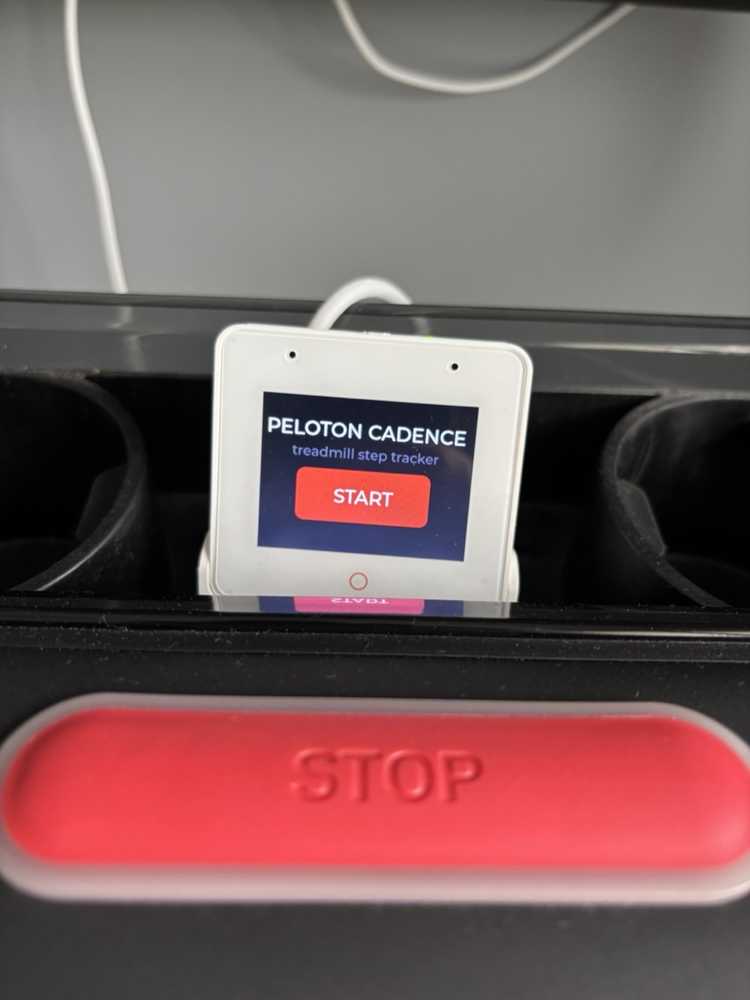
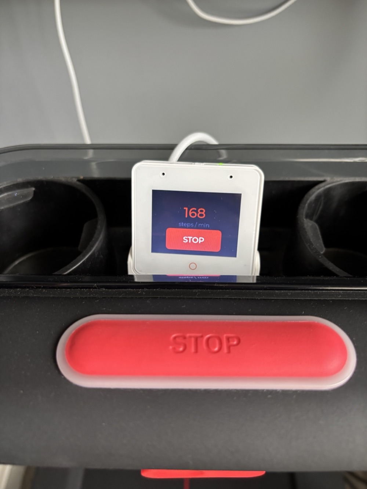

# ESP32-S3-BOX-3B — Treadmill Cadence Meter

A proof-of-concept running-cadence meter for the **ESP32-S3-BOX-3B**, built on
native **ESP-IDF** + the official `espressif/esp-box-3` BSP and LVGL.

Set the device on a treadmill. Each foot-strike "bangs" the deck; the onboard
accelerometer (ICM-4267x) registers the impact. The app counts impacts, computes
a **live rolling cadence (steps/min)**, and shows a touchscreen flow:

**START** → big live steps/min number → **STOP** → **session summary** with the
average cadence, total steps, duration, and a cadence-over-time line graph →
**DONE**. Peloton-styled dark/red theme.

> The BOX-3B is the basic variant of the ESP32-S3-BOX-3 (same SoC/mainboard,
> fewer accessories). Everything here targets `esp32s3` and the `esp-box-3` BSP.

## In action
Running on a treadmill console — idle/START screen and live cadence at 168 steps/min:

| Idle (START) | Running (live cadence) |
|:---:|:---:|
|  |  |

## Repo layout
```
firmware/                 ESP-IDF project (the cadence app)
  main/cadence_main.c      IMU step detection, rolling cadence, LVGL UI
  main/idf_component.yml    pinned BSP/LVGL/codec versions
  sdkconfig.defaults        octal PSRAM, USB-JTAG console, fonts, color swap
  patches/apply_bsp_patches.py   re-applies the two BOX-3B BSP fixes
  README.md                build / patch / flash instructions
docs/
  SETUP_GUIDE.md            full toolchain setup + every BOX-3B gotcha & fix
skills/
  esp-idf-box3-builder/     Claude Code skill: native ESP-IDF BOX-3/3B workflow
  esphome-box3-builder/     Claude Code skill: ESPHome workflow (+ validated findings)
```

## Quick start
```bash
. ~/esp/esp-idf/export.sh
cd firmware
idf.py set-target esp32s3
python3 patches/apply_bsp_patches.py     # BOX-3B BSP fixes (re-run after dep changes)
idf.py build
idf.py -p /dev/cu.usbmodem101 flash monitor
```
New to ESP-IDF on this board? Start with [`docs/SETUP_GUIDE.md`](docs/SETUP_GUIDE.md).

## What this project documents (the hard part)
Getting a stock BOX-3B to run took working around several non-obvious issues —
all captured in `docs/SETUP_GUIDE.md` and `skills/esp-idf-box3-builder/references/`:
- Connect to the **device**, not the dock hub; use a data cable.
- Repair the IDF Python env `install.sh` leaves broken on py3.9.
- Touch (GT911 @ 0x5D): zero `scl_speed_hz` for the legacy I²C LCD driver, and
  bring up touch via `bsp_display_start()` (shared GPIO48 reset).
- **Octal** PSRAM config; pin `esp_codec_dev` 1.1.0 to avoid an I²C driver
  conflict; `CONFIG_LV_COLOR_16_SWAP=y` for correct colors.
- IMU (ICM-4267x) confirmed on I²C 0x68 (WHO_AM_I 0x60 on the 3B).

## Tuning
Step-detection thresholds are `#define`s at the top of `firmware/main/cadence_main.c`
(`THRESHOLD_G`, `MIN_STEP_MS`, `WINDOW_MS`, …). Watch the `STEP # d=..g` serial log
to tune against your treadmill. See `firmware/README.md`.

## Credits & license
- Firmware, ESP-IDF setup guide, BSP patches, and the `esp-idf-box3-builder`
  skill: authored here. MIT licensed (see `LICENSE`).
- The `esphome-box3-builder` skill is included from a separate source for
  convenience (ESPHome path), with an added `box3b-validated-findings.md`
  reference; it retains its original authorship/terms.
- Not affiliated with or endorsed by Peloton or Espressif; "Peloton" branding
  colors are used only to style this personal PoC.
